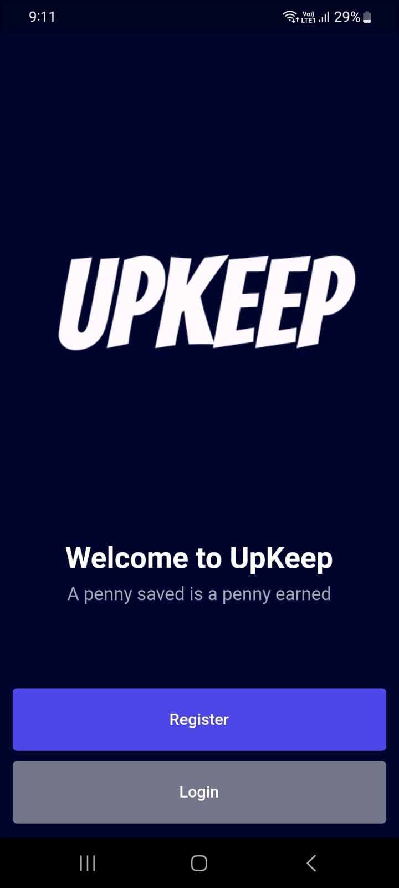
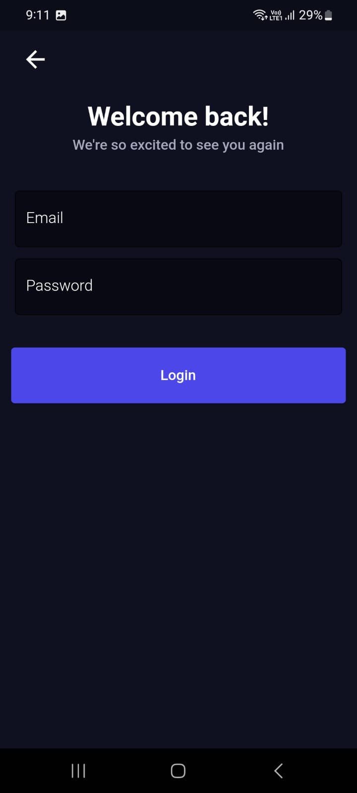
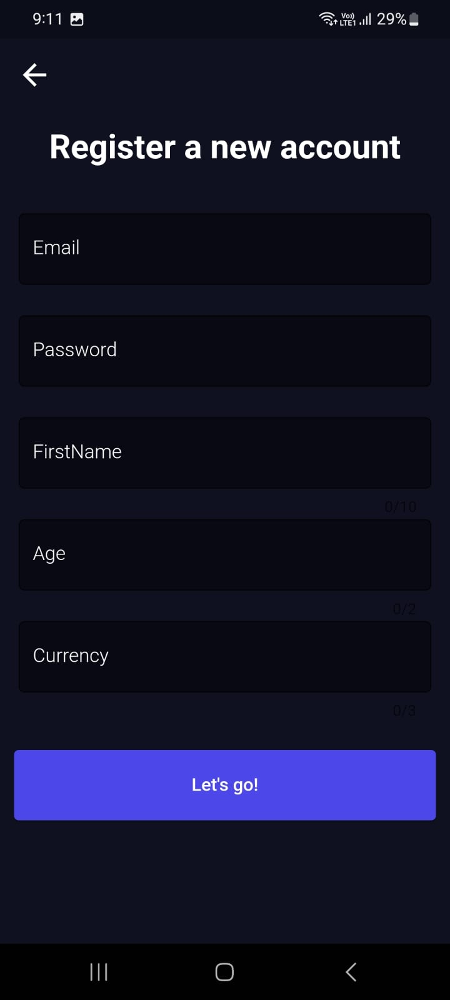
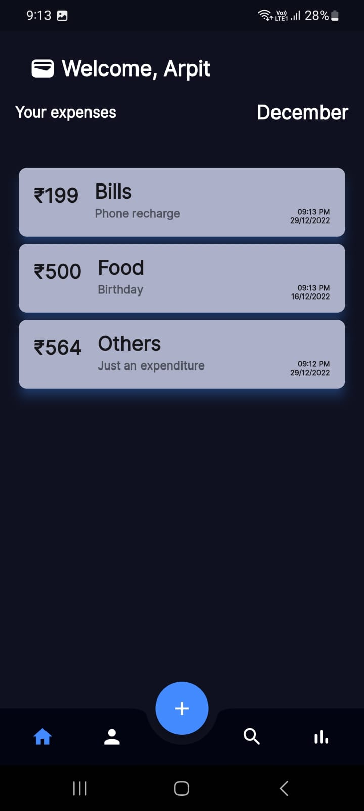
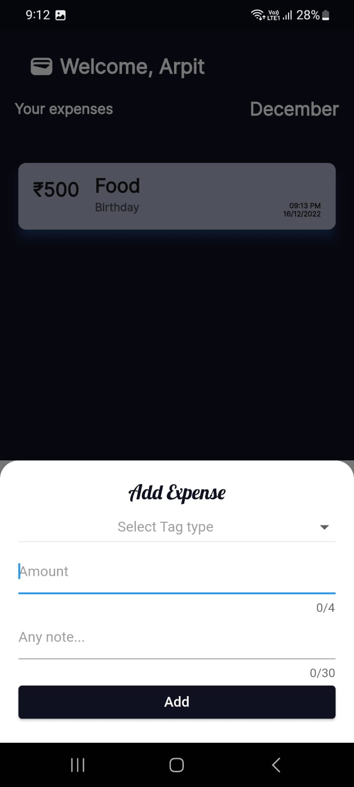
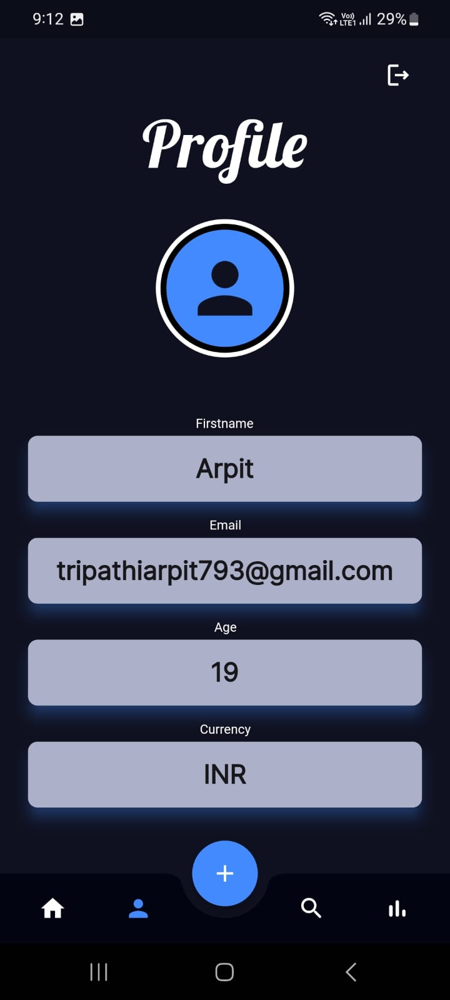

UpKeep -
Hello user! UpKeep is a budgeting app purely build for a person like you who likes to keep track of his expenses, as we say a penny saved is a penny earned. Here you can add your expenses by giving the amount, the tag under which the expense comes. Also you can provide a short note in case you want to remember something about your expense.

What are tags?
Tags are used to filter your expense and put them under some category like Food, Travel, Rent etc. It helps you to monitor your expenses under particular categories and to get a better understanding in which areas you should save more. ,

What are notes?
Notes as they go by their name they will help you to remember any minute details regarding your expense. 

## User Interface
<table>
  <tr>
    <td>Welcome Page</td>
     <td>Login Page</td>
     <td>Register Page</td>
  </tr>
  <tr>
    <td></td>
    <td></td>
    <td></td>
  </tr>
 </table>
 <table>
  <tr>
    <td>Home Page</td>
     <td>Add Expense Page</td>
     <td>Profile Page</td>
  </tr>
  <tr>
    <td></td>
    <td></td>
    <td></td>
  </tr>
 </table>

